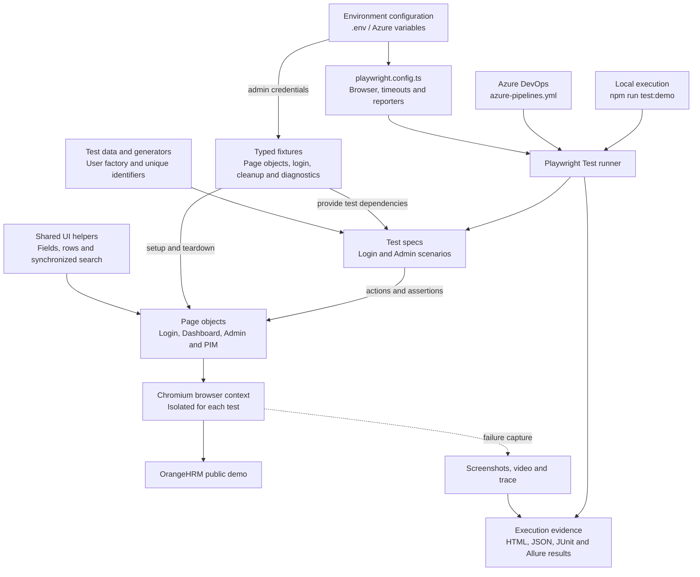

# OrangeHRM Playwright Test Automation

QA automation project for the **OrangeHRM** web application using **Playwright and TypeScript**.

The project combines manual test design with automated UI testing, reusable test architecture, test reporting, and CI/CD execution through **Azure DevOps**.

## Project Overview

* **72 functional test cases** designed for OrangeHRM
* **23 Playwright tests** currently automated
* Tests written in **TypeScript**
* **Page Object Model (POM)** for page interactions
* Reusable **Playwright fixtures**
* Dynamic test data generation
* **GitHub** for source control
* **Azure DevOps** for CI/CD test execution
* **Allure** for test reporting
* **Playwright HTML Report** for local test results

## Automated Test Coverage

The current automation covers selected OrangeHRM functionality from the manually designed test suite.

### Login — 7 tests

* Valid login
* Invalid username
* Invalid password
* Empty username
* Empty password
* Empty username and password
* Logout

### Admin — 16 tests

#### User Management — 4 tests

* Add an ESS user
* Search for and delete an ESS user
* Validate mandatory fields when adding a user
* Validate duplicate username handling

#### Departments — 4 tests

* Add a department
* Edit a department
* Delete a department
* Validate department data

#### Employment Status — 4 tests

* Add an employment status
* Edit an employment status
* Delete an employment status
* Validate employment status data

#### Job Titles — 4 tests

* Add a job title
* Edit a job title
* Delete a job title
* Validate job title data

> **Current automation:** 23 tests
> **Manual test suite:** 72 functional test cases
>
> Automated coverage is being expanded progressively from the broader manual test suite.
>
> Recorded local run, 29 September 2026: **22 passed, 1 failed**. The [department edit investigation](docs/bug-reports/department-edit-investigation.md) documents the HTTP 422 failure.

## Technology Stack

| Technology             | Purpose                              |
| ---------------------- | ------------------------------------ |
| Playwright             | UI test automation                   |
| TypeScript             | Test development                     |
| Node.js                | Runtime and package management       |
| Page Object Model      | Maintainable page interactions       |
| Playwright Fixtures    | Reusable test setup and dependencies |
| GitHub                 | Source control and project hosting   |
| Azure DevOps           | CI/CD test execution                 |
| Allure                 | Test reporting                       |
| Playwright HTML Report | Local test reporting                 |
| Prettier               | Code formatting                      |

## Test Automation Architecture

The project uses the **Page Object Model** to separate test logic from page interactions.
Typed fixtures provide authentication, page objects, resource cleanup and HTTP diagnostics.



**Test lifecycle:** Playwright creates an isolated browser context. Requested fixtures
provide page objects and authenticate Admin tests. Each scenario creates its own data,
performs actions through page objects and asserts the result. Teardown removes registered
records in reverse order and attaches cleanup outcomes, including after assertion failures.

This structure keeps test cases readable and allows common page interactions and setup to be reused across tests.

## Project Structure

```text
OrangeHRM-playwright/
├── tests/
│   ├── login/
│   │   └── login.spec.ts
│   └── admin/
│       ├── users.spec.ts
│       ├── departments.spec.ts
│       ├── employment-status.spec.ts
│       └── job-titles.spec.ts
├── fixtures/
│   └── test-fixtures.ts          # Typed fixtures, authentication and resource lifecycle
├── pages/
│   ├── LoginPage.ts
│   ├── DashboardPage.ts
│   ├── AdminPage.ts              # Shared Admin page base
│   ├── UserManagementPage.ts
│   ├── DepartmentsPage.ts
│   ├── EmploymentStatusPage.ts
│   ├── JobTitlesPage.ts
│   └── PimPage.ts                # Employee setup and cleanup for user tests
├── test-data/
│   ├── users.ts                 # Typed ESS account factory
│   ├── employees.ts             # Data definitions for future coverage
│   ├── leave.ts                 # Data definitions for future coverage
│   └── recruitment.ts           # Data definitions for future coverage
├── utils/
│   ├── ui.ts                    # Scoped field/row locators and search synchronization
│   ├── environment.ts           # Environment-specific administrator credentials
│   └── data-generator.ts        # Unique test values and date helper
├── scripts/
│   ├── run-demo.mjs             # Timestamped runs and execution metadata
│   └── allure-report.mjs        # Allure report generation
├── docs/
│   ├── bug-reports/             # Defect reports and department-edit investigation
│   └── test-scenarious/         # Manual test-case and scenario workbooks
├── playwright.config.ts        # Browser, execution settings and reporters
├── azure-pipelines.yml         # CI installation, execution and report publication
├── tsconfig.json               # Strict TypeScript configuration
├── package.json                # Commands and development dependencies
├── package-lock.json           # Locked dependency versions
├── .env.example                # Example environment configuration
├── .gitignore
├── .prettierrc
└── README.md
```

## CI/CD

The project uses **Azure DevOps** to execute the Playwright test suite.

### Pipeline workflow

```text
GitHub
   ↓
Azure DevOps Pipeline
   ↓
Install Node.js
   ↓
Install dependencies
   ↓
Install Playwright browsers
   ↓
Run Playwright tests
   ↓
Generate test reports
   ↓
Publish test artifacts
```

The Azure DevOps pipeline is defined in:

```text
azure-pipelines.yml
```

This demonstrates integration between source control and automated test execution through CI/CD.

## Running Tests Locally

Use **Node.js 22**, matching the Azure pipeline.

### Install dependencies

```bash
npm ci
```

### Install Playwright browsers

```bash
npx playwright install chromium
```

### Run the full test suite

```bash
npm run test:demo
```

The runner prints an `artifacts/baseline-*` directory containing the reports and execution metadata.

### Run tests in headed mode

```bash
npx playwright test --headed
```

### Run a specific test file

```bash
npx playwright test tests/admin/departments.spec.ts
```

### Run tests in debug mode

```bash
npx playwright test --debug
```

### Open the Playwright HTML report

```bash
npx playwright show-report <run-directory>/playwright-report
```

## Allure Reporting

The project uses **Allure** for test reporting in addition to the Playwright HTML report.

Replace `<run-directory>` with the path printed by `npm run test:demo`.

Generate the Allure report:

```bash
npm run allure:report -- <run-directory>
```

Open the report locally:

```bash
npm run allure:open -- <run-directory>/allure-report
```

## Test Data

The project uses **dynamic test data** for scenarios where unique values are required.

For example, dynamically generated values can be used when creating departments, employment statuses, job titles, or users. This helps reduce conflicts when tests are executed repeatedly.

Environment-specific configuration is stored using environment variables.

Example configuration:

```text
.env.example
```

Sensitive local configuration is kept outside source control through `.gitignore`.

## Quality Approach

The project combines manual test design with automated testing.

The manual test suite considers:

* Positive scenarios
* Negative scenarios
* Boundary and edge cases
* Functional validation
* Role-based behaviour

The automation focuses on selected high-value scenarios and demonstrates how manually designed test cases can be translated into maintainable automated tests.

## Key QA Automation Practices

This project demonstrates practical use of:

* **Playwright**
* **TypeScript**
* **Page Object Model**
* **Reusable fixtures**
* **Dynamic test data**
* **Environment variables**
* **Test reporting**
* **CI/CD with Azure DevOps**
* **Source control with GitHub**
* **Code formatting with Prettier**

## Project Goal

The goal of this project is to demonstrate practical QA automation skills using a realistic web application.

It shows the progression from **manual test design to automated UI testing and CI/CD execution**, using tools and practices commonly used in modern QA engineering.

## Test Execution Demo

The Azure DevOps pipeline is configured to run Playwright tests after changes are pushed to the `main` branch.

The pipeline generates an Allure report and publishes it as a pipeline artifact.


## Author

**Igor Zigelbaum**

QA Engineer | Software Tester | Test Automation

* GitHub: [IgorZig](https://github.com/IgorZig)
* LinkedIn: [Igor Zigelbaum](https://www.linkedin.com/in/igorzigelbaum)
