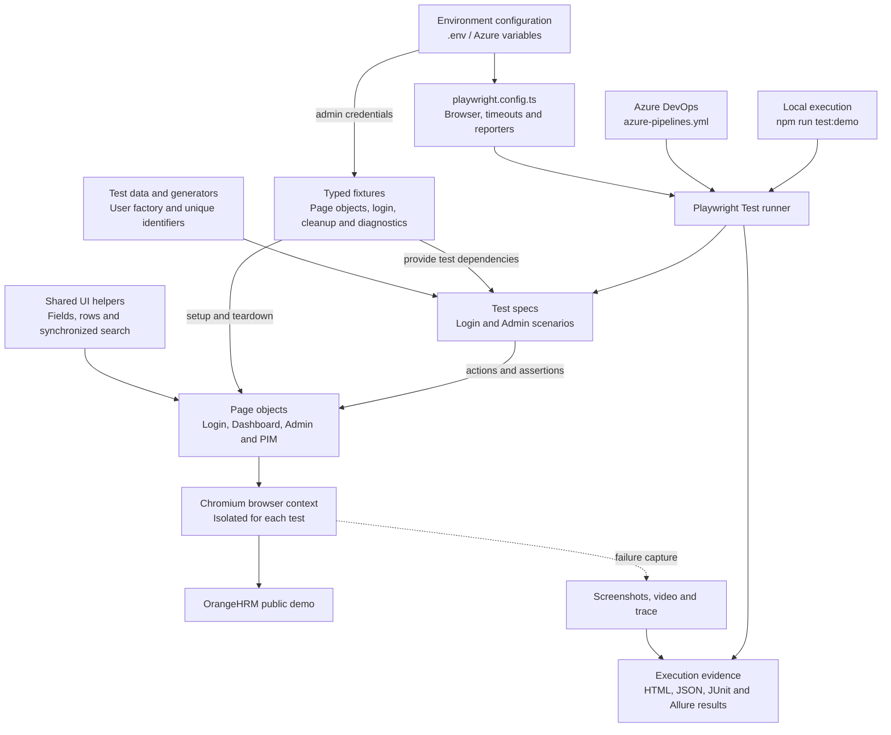

# OrangeHRM Playwright QA Portfolio

UI test automation for the [OrangeHRM public demo](https://opensource-demo.orangehrmlive.com),
built with **Playwright, TypeScript, Page Object Model and Azure DevOps**.

The project demonstrates independent test setup, generated test data, cleanup after
failures, persisted-state assertions and investigation of application defects.

## Coverage and results

**Recorded local run — 29 September 2026:** 22 passed, 1 failed, 0 skipped.
All 23 tests ran in headless Chromium with one worker and no retries in approximately
3 minutes 36 seconds. The failure concerns department editing and is documented in
the [defect investigation](docs/bug-reports/department-edit-investigation.md).

| Area | Tests | Behaviour checked |
| --- | ---: | --- |
| Login | 7 | Valid and invalid credentials, required fields, logout and protected-route access |
| User management | 4 | ESS creation, employee association, search/delete, required fields and duplicate usernames |
| Departments | 4 | Create, edit persistence, delete and required name; edit fails in the recorded run |
| Employment status | 4 | Create, edit persistence, delete and required name |
| Job titles | 4 | Create with description, edit persistence, delete and required title |
| **Total** | **23** | **Chromium UI tests** |

PIM employee creation supplies test-owned data for user-management scenarios.
The current automated scope is Login and selected Admin workflows.

## Manual testing

The [test-case workbook](docs/test-scenarious/I_Zigelbaum_TestScenarioAndTestCases.xlsx)
contains 72 cases across PIM, Admin, Login, Leave, Time and Attendance, and Recruitment.
A separate [scenario workbook](docs/test-scenarious/I_Zigelbaum_TestScenarios.xlsx)
contains 72 scenarios. Workbook execution statuses are historical manual records,
separate from the automated results above.

The [defect reports](docs/bug-reports) include reproduction steps, expected and actual
results, and supporting observations.

## Architecture

### How the framework works



**Test lifecycle:** Playwright creates an isolated browser context. Requested fixtures
provide page objects and authenticate Admin tests. Each scenario creates its own data,
performs actions through page objects and asserts the result. Teardown removes registered
records in reverse order and attaches cleanup outcomes, including after assertion failures.

### Project structure

```text
OrangeHRM-playwright/
├── tests/
│   ├── login/
│   │   └── login.spec.ts
│   └── admin/
│       ├── users.spec.ts
│       ├── departments.spec.ts
│       ├── employment-status.spec.ts
│       └── job-titles.spec.ts
├── fixtures/
│   └── test-fixtures.ts          # Typed fixtures, authentication and resource lifecycle
├── pages/
│   ├── LoginPage.ts
│   ├── DashboardPage.ts
│   ├── AdminPage.ts              # Shared Admin page base
│   ├── UserManagementPage.ts
│   ├── DepartmentsPage.ts
│   ├── EmploymentStatusPage.ts
│   ├── JobTitlesPage.ts
│   └── PimPage.ts                # Employee setup and cleanup for user tests
├── test-data/
│   ├── users.ts                 # Typed ESS account factory
│   ├── employees.ts             # Data definitions for future coverage
│   ├── leave.ts                 # Data definitions for future coverage
│   └── recruitment.ts           # Data definitions for future coverage
├── utils/
│   ├── ui.ts                    # Scoped field/row locators and search synchronization
│   ├── environment.ts           # Environment-specific administrator credentials
│   └── data-generator.ts        # Unique test values and date helper
├── scripts/
│   ├── run-demo.mjs             # Timestamped runs and execution metadata
│   └── allure-report.mjs        # Allure report generation
├── docs/
│   ├── bug-reports/             # Defect reports and department-edit investigation
│   └── test-scenarious/         # Manual test-case and scenario workbooks
├── playwright.config.ts        # Browser, execution settings and reporters
├── azure-pipelines.yml         # CI installation, execution and report publication
├── tsconfig.json               # Strict TypeScript configuration
├── package.json                # Commands and development dependencies
├── package-lock.json           # Locked dependency versions
├── .env.example                # Example environment configuration
├── .gitignore
├── .prettierrc
└── README.md
```

Generated evidence lives under `artifacts/` and is excluded from Git. The execution
script records run metadata; Playwright writes reports and failure attachments, and
the Allure script builds the report from its result files. Azure publishes CI results
and artifacts after execution.

### Design decisions

| Component | Responsibility |
| --- | --- |
| Test specs | Describe business scenarios and verify observable outcomes |
| Fixtures | Supply typed dependencies, authenticate tests, track resources and run teardown |
| Page objects | Encapsulate page interactions and reusable field/record checks |
| Test data | Build scenario inputs independently of page interactions |
| UI helpers | Reuse exact row matching, field scoping and response-aware searches |
| Configuration | Set the target environment, browser, timeouts and reporters |
| Scripts and CI | Run the suite reproducibly and collect execution evidence |

Create, edit and delete scenarios reopen pages or repeat searches to verify persistence.
User-management tests create an employee before an ESS account; cleanup deletes the
account before the employee. Locators prefer roles and exact scoped text, with CSS
where the application lacks accessible labels. Edit methods wait for the current
value to load before changing it.

## Run locally

Use **Node.js 22**, matching the Azure pipeline.

```bash
npm ci
npx playwright install chromium
npm run typecheck
npm run format:check
npm run test:demo
```

The public demo is the default target. Copy `.env.example` to an ignored `.env` to
configure `BASE_URL`, `ADMIN_USERNAME` and `ADMIN_PASSWORD`. The demo fallback is
limited to the public demo host; other environments require their own credentials.

Useful commands:

```bash
npx playwright test --list
npm run test:demo -- tests/login/login.spec.ts
npm run test:headed
npm run test:ui
```

The configuration uses a 60-second test timeout, 15-second action timeout and
10-second assertion timeout. Tests run with one worker and no retries.

## Reports

`npm run test:demo` prints a new `artifacts/baseline-*` directory. It records the
source commit, working-tree state, execution settings and results in `execution.json`.
The directory also contains Playwright HTML, JSON, JUnit and Allure results, with
screenshots, videos and traces retained for failures.

Replace `<run-directory>` with the path printed by the runner:

```bash
npx playwright show-report <run-directory>/playwright-report
npm run allure:report -- <run-directory>
npm run allure:open -- <run-directory>/allure-report
```

Generated reports are Git-ignored and must be produced locally or downloaded from
a CI run. Review reports before sharing: diagnostic attachments can contain account
and session data.

## Azure DevOps

The [Azure pipeline](azure-pipelines.yml) installs Node 22, locked npm dependencies,
Chromium and system dependencies, then type-checks and runs the tests. It publishes
JUnit results and an evidence artifact containing reports and failure diagnostics.
Reporting steps also run after test failures.

Configure `BASE_URL` and `ADMIN_USERNAME` as pipeline variables and `ADMIN_PASSWORD`
as a secret variable. The documented execution result above is local; an Azure run
result is not included. Azure DevOps is the current CI configuration; the earlier
GitHub Actions workflow has been retired.

## Scope and next steps

The shared demo can reset or be modified by other users. Generated names reduce
collisions, but runs remain dependent on demo availability. Configuration-list cleanup
currently checks rendered records and has not been validated with large paginated lists.

Next priorities are ESS permission checks, disabled-account behaviour and selected
field boundaries. Standalone PIM, Leave, Time and Recruitment automation remain planned.

## Author

**Igor Zigelbaum** — QA Engineer | Software Tester | Test Automation

- GitHub: [IgorZig](https://github.com/IgorZig)
- LinkedIn: [Igor Zigelbaum](https://www.linkedin.com/in/igorzigelbaum)
